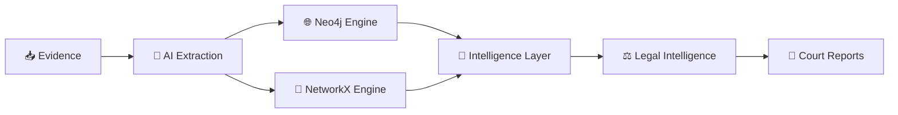

<p align="center">
  
  <br />
  <strong style="color: #3b82f6; font-size: 1.3em;">सद्रक्षणाय खलनिग्रहणाय</strong>
</p>

<h1 align="center">
  <a href="https://git.io/typing-svg"></a>
</h1>

<p align="center">
  <em>सद्रक्षणाय खलनिग्रहणाय (To protect the good and to destroy the evil)</em>
</p>

<p align="center">
  
  
  
  
  
  
  
  
</p>

<br/>

A comprehensive, dual-purpose digital platform developed as an homage to the **Maharashtra Police** force and as a cutting-edge operational tool for the **Pune Police Cybercrime Cell**. This repository houses both a stunning public-facing cinematic tribute and a secure, highly advanced financial fraud intelligence dashboard.

<div align="center">
  
### 🌍 Live Deployment
[](https://maharashtra-pride-1.vercel.app)
[](https://backend-wine-zeta-81.vercel.app)

</div>

---

## 🌟 Part I: Maharashtra Police Pride (The Cinematic Landing)

The root application serves as a high-fidelity, scroll-driven interactive web experience honoring the history and scale of India's largest state police force. 

### 🎭 Cinematic Modules
1. **The Grand Entry**: Framer Motion powered hero sections featuring **Cinematic Scroll Animation** with dynamic typography and **Glassmorphism Hover** panels layered over deep dark themes (`#0d0d0d`).
2. **The 36 Districts & 185,000 Officers**: A narrative scrollytelling experience. As the user scrolls, dynamic counters and historical timelines fade into view, explaining the scale of the force defending 11.42 crore citizens.
3. **Interactive Commissionerates Cloth**: A physics-simulated **Interactive Fluid Simulation** and WebGL grid showcasing the 12 primary Police Commissionerates. Users interact with the cloth via a **Magnetic Cursor** and **Gooey Effect** tracking.

---

<div align="center">

# 🕵️‍♂️ FRAUDLENS PORTAL

### ⚡ THE FINANCIAL INTELLIGENCE APPLICATION


<br>


</div>

---

# 🌌 

Beyond the secure access layer lies **FraudLens**, an AI-native financial intelligence platform purpose-built for cybercrime investigators, financial crime units, and law enforcement agencies.

FraudLens transforms fragmented evidence sources — bank statements, screenshots, chat exports, transaction logs, and intelligence reports — into a unified investigative intelligence graph capable of exposing criminal syndicates, money mule networks, laundering chains, and organized cyber-fraud operations.

<div align="center">

📥 
<br><br>
🤖 
<br><br>
🌐 
<br><br>
🧠 
<br><br>
⚖️ 
<br><br>
📜 

</div>

---

# ⚡ 

<div align="center">

| Intelligence System | Purpose                                                | Tech Badge |
| ------------------- | ------------------------------------------------------ | :--- |
| 📥 Ingest           | AI-powered evidence ingestion & transaction extraction |  |
| 🌐 Graph            | Interactive 3D criminal syndicate visualization        |  |
| ⚖️ Intelligence     | BNS 2023 legal intelligence & threat mapping           |  |
| 🧠 ML Lab           | Latent-space anomaly detection & clustering            |  |
| 📂 Cases            | Kanban-based investigation management                  |  |
| 📜 Reports          | Section 65B court-ready report generation              |  |
| 🚨 Alerts           | Real-time WebSocket intelligence feed featuring **Cyberpunk Scanline Effect** & **Terminal Command Animation** |  |
| 🏦 Entities         | Centralized account intelligence registry              |  |
| 🗺️ Maps            | Geospatial transaction analysis                        |  |
| 🔍 OSINT            | Open-source intelligence enrichment                    |  |
| 🧩 Patterns         | Fraud typology detection engine                        |  |
| 🚫 Watchlist        | High-risk entity monitoring                            |  |
| 🎯 Command Center   | Executive intelligence dashboard with **Bento Grid Hover Effect** & **Isometric Hover Effect** |  |

</div>

---

# 🏢 

<div align="center">



</div>

## 🌐 

```cypher
MATCH path = (a)-[*1..3]-(b)
RETURN path
```

✔ Enterprise Graph Analytics

✔ Multi-Hop Syndicate Traversal

✔ Criminal Network Discovery

✔ High-Speed Cypher Queries

✔ Production-Scale Intelligence Operations

---

## 🐍 

Unlike traditional intelligence platforms requiring complex infrastructure, FraudLens includes a fully operational standalone graph engine.

```python
graph_store.json
```

✔ Zero Database Dependencies

✔ No Docker Requirement

✔ Fully Portable Investigations

✔ Offline Operational Capability

✔ Rapid Field Deployment

---

## 🚨 

Every entity continuously receives a dynamic behavioral risk score.

<div align="center">


<br><br>

<br><br>
🔴 

</div>

High-risk entities automatically surface across investigative dashboards and intelligence pipelines.

---

# 🤖 

<div align="center">


</div>

### Supported Evidence Sources

<div align="center">
  
  
  
  
  
  
  
</div>

### AI Processing Engine

Powered by:

```text
google/gemini-2.5-pro
via OpenRouter
```

Capabilities:

✨ Transaction Extraction (with **Text Scramble Effect**)

✨ Entity Recognition

✨ Relationship Discovery

✨ Contextual Intelligence (with **Cyber Decrypt Reveal**)

✨ Structured JSON Generation

✨ Confidence Validation

---

## 🎯 Human Verification Layer

Every extracted transaction receives an intelligence confidence score.

```text
Confidence ≥ 0.80
      ✅ Approved

Confidence < 0.80
      🔴 Manual Review
```

No intelligence enters the graph without verification safeguards.

---

# 🌌 

Built using:

```text
react-force-graph-3d
three.js
WebGL
✨ WebGL Displacement Effect
✨ Infinite Particle Flow
```

FraudLens renders criminal ecosystems as living, interactive intelligence networks leveraging a **Particle Network** and **Orbit Animation**.

### Visual Threat Classification

<div align="center">
  <br>
  
  
  
  
  <br>
</div>

### Investigator Capabilities

🌐 Explore Multi-Hop Networks

🎯 Isolate Money Mule Chains

🕸️ Discover Hidden Relationships

🚀 Orbit Suspicious Actors

🔍 Traverse Up To 3 Degrees

⚡ Real-Time Risk Highlighting

---

# ⚖️ 

FraudLens continuously monitors active investigations for syndicate formation.

### Shared Mule Detection

Automatically identifies (via **Matrix Rain Effect** & **Neon Flicker Effect** processing logs):

✔ Cross-FIR Connections

✔ Multi-State Operations

✔ Shared Banking Infrastructure

✔ Organized Criminal Ecosystems

---

### Automated Charge Recommendations

```text
⚖️ BNS 318
Cheating

⚖️ BNS 336
Forgery

🛡️ IT Act 66D
Cyber Fraud
```

Investigators receive legal intelligence in real-time.

---

# 📡 

The platform projects complex graph relationships into a visual risk space using **AI Data Visualization Animation** and a **Holographic Effect**.

<div align="center">
   ➜ 
   ➜ 
   ➜ 
  
</div>

### Detection Capabilities

🧠 Isolation Forest Inspired Logic (with **Blur-to-Focus Reveal**)

📊 Latent Space Visualization

🚨 Anomaly Detection

🔍 Behavioral Clustering

⚡ Threat Prioritization

🎯 Investigator Guidance

---

# 📂 

When multiple critical-risk entities emerge:

```text
🚨 Alert Triggered
       ↓
📂 Case Created
       ↓
👮 Investigator Assigned
       ↓
🔍 Active Investigation
       ↓
📜 Report Generated
```

The Kanban board provides drag-and-drop operational control using **Smooth Page Transition** and **Scroll Reveal** mechanics while maintaining live synchronization.

---

# 📜 

FraudLens bridges intelligence gathering and prosecution.

### Generated Evidence Packages

📄 

🕒 

🔗 

🧠 

📊 

⚖️ 

All reports are designed for admissibility under Section 65B of the Indian Evidence Act.

---

# 🛠️ 

<div align="center">

## Frontend Intelligence Layer


## State & Data Layer


## Visualization Layer


## Backend Intelligence Layer


## AI & Infrastructure


</div>

---

## 📁 Directory Structure Overview

<p align="center">
  
</p>

---

## ⚙️ Local Setup Instructions

<p align="center">
  
</p>

### 1. Backend Setup


```sh
cd backend
pip install -r requirements.txt
export OPENROUTER_API_KEY="your-api-key-here"
uvicorn main:app --host 0.0.0.0 --port 8000
```

### 2. Frontend Setup


```sh
npm install
npm run dev
```

---

# 📜 

This repository is governed by the **MIT License + Special Indian Law Enforcement Homage Rider**.

<div align="center">


</div>

### ⚖️ Legal Status & Permitted Scope

1. **Indian Law Enforcement Agencies**: Full authorization is granted for direct deployment, local hosting, simulation, and case graph building under Section 65B of the Indian Evidence Act.
2. **Academic & Tribute Usage**: Permitted for public demonstration, presentation, training, and educational modification.
3. **Commercial Redistribution Restrictions**: Commercial resale, sublicensing, or deployment as a paid software-as-a-service (SaaS) tool is **strictly prohibited** under the proprietary homage rider.

For full license terms, please refer to the [LICENSE](LICENSE) file in the root of this project.

---

<div align="center">

# 🚀 

### From Evidence → Intelligence → Action

FraudLens empowers investigators to uncover hidden financial syndicates, expose cybercrime infrastructure, accelerate investigations, and generate legally defensible evidence through a unified AI-powered intelligence ecosystem.


</div>
