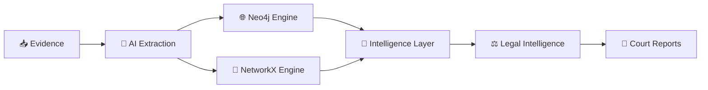

<p align="center">
  
  <br />
  <strong style="color: #3b82f6; font-size: 1.3em;">सद्रक्षणाय खलनिग्रहणाय</strong>
</p>

<h1 align="center">
  <a href="https://git.io/typing-svg"></a>
</h1>

<p align="center">
  <em>सद्रक्षणाय खलनिग्रहणाय (To protect the good and to destroy the evil)</em>
</p>

<p align="center">
  
  
  
  
  
  
  
  
</p>

<br/>

A comprehensive, dual-purpose digital platform developed as an homage to the **Maharashtra Police** force and as a cutting-edge operational tool for the **Pune Police Cybercrime Cell**. This repository houses both a stunning public-facing cinematic tribute and a secure, highly advanced financial fraud intelligence dashboard.

<div align="center">
  
### 🌍 Live Deployment
[](https://maharashtra-pride-1.vercel.app)
[](https://backend-wine-zeta-81.vercel.app)

</div>

---

## 🌟 Part I: Maharashtra Police Pride (The Cinematic Landing)

The root application serves as a high-fidelity, scroll-driven interactive web experience honoring the history and scale of India's largest state police force. 

### 🎭 Cinematic Modules
1. **The Grand Entry**: Framer Motion powered hero sections with dynamic typography and glassmorphism layered over deep dark themes (`#0d0d0d`).
2. **The 36 Districts & 185,000 Officers**: A narrative scrollytelling experience. As the user scrolls, dynamic counters and historical timelines fade into view, explaining the scale of the force defending 11.42 crore citizens.
3. **Interactive Commissionerates Cloth**: A physics-simulated, interactive WebGL grid showcasing the 12 primary Police Commissionerates across the state. Users can interact with the cloth simulation via cursor tracking.

---

<div align="center">

# 🕵️‍♂️ FRAUDLENS PORTAL

### ⚡ THE FINANCIAL INTELLIGENCE APPLICATION


<br>


</div>

---

# 🌌 Behind The Portal Gate

Beyond the secure access layer lies **FraudLens**, an AI-native financial intelligence platform purpose-built for cybercrime investigators, financial crime units, and law enforcement agencies.

FraudLens transforms fragmented evidence sources — bank statements, screenshots, chat exports, transaction logs, and intelligence reports — into a unified investigative intelligence graph capable of exposing criminal syndicates, money mule networks, laundering chains, and organized cyber-fraud operations.

```text
📥 RAW EVIDENCE
        ↓
🤖 AI EXTRACTION
        ↓
🌐 GRAPH INTELLIGENCE
        ↓
🧠 RISK ANALYTICS
        ↓
⚖️ LEGAL MAPPING
        ↓
📜 COURT ADMISSIBLE REPORTS
```

---

# ⚡ 13 Specialized Intelligence Modules

<div align="center">

| Intelligence System | Purpose                                                |
| ------------------- | ------------------------------------------------------ |
| 📥 Ingest           | AI-powered evidence ingestion & transaction extraction |
| 🌐 Graph            | Interactive 3D criminal syndicate visualization        |
| ⚖️ Intelligence     | BNS 2023 legal intelligence & threat mapping           |
| 🧠 ML Lab           | Latent-space anomaly detection & clustering            |
| 📂 Cases            | Kanban-based investigation management                  |
| 📜 Reports          | Section 65B court-ready report generation              |
| 🚨 Alerts           | Real-time WebSocket intelligence feed                  |
| 🏦 Entities         | Centralized account intelligence registry              |
| 🗺️ Maps            | Geospatial transaction analysis                        |
| 🔍 OSINT            | Open-source intelligence enrichment                    |
| 🧩 Patterns         | Fraud typology detection engine                        |
| 🚫 Watchlist        | High-risk entity monitoring                            |
| 🎯 Command Center   | Executive intelligence dashboard                       |

</div>

---

# 🏢 Dual Graph Intelligence Architecture

<div align="center">



</div>

## 🌐 Neo4j Production Engine

```cypher
MATCH path = (a)-[*1..3]-(b)
RETURN path
```

✔ Enterprise Graph Analytics

✔ Multi-Hop Syndicate Traversal

✔ Criminal Network Discovery

✔ High-Speed Cypher Queries

✔ Production-Scale Intelligence Operations

---

## 🐍 Portable NetworkX Engine

Unlike traditional intelligence platforms requiring complex infrastructure, FraudLens includes a fully operational standalone graph engine.

```python
graph_store.json
```

✔ Zero Database Dependencies

✔ No Docker Requirement

✔ Fully Portable Investigations

✔ Offline Operational Capability

✔ Rapid Field Deployment

---

## 🚨 Dynamic Risk Intelligence

Every entity continuously receives a dynamic behavioral risk score.

```text
₹100,000+ Volume
       ↓
Risk Score ≥ 0.90
       ↓
🔴 Critical Threat
```

High-risk entities automatically surface across investigative dashboards and intelligence pipelines.

---

# 🤖 Multimodal AI Evidence Pipeline

<div align="center">


</div>

### Supported Evidence Sources

```text
📄 PDF Statements
📊 Excel Files
📋 CSV Data
📝 Word Documents
📷 Screenshots
💬 WhatsApp Chats
🏦 Banking Records
```

### AI Processing Engine

Powered by:

```text
google/gemini-2.5-pro
via OpenRouter
```

Capabilities:

✨ Transaction Extraction

✨ Entity Recognition

✨ Relationship Discovery

✨ Contextual Intelligence

✨ Structured JSON Generation

✨ Confidence Validation

---

## 🎯 Human Verification Layer

Every extracted transaction receives an intelligence confidence score.

```text
Confidence ≥ 0.80
      ✅ Approved

Confidence < 0.80
      🔴 Manual Review
```

No intelligence enters the graph without verification safeguards.

---

# 🌌 3D Threat Network Explorer

Built using:

```text
react-force-graph-3d
three.js
WebGL
```

FraudLens renders criminal ecosystems as living, interactive intelligence networks.

### Visual Threat Classification

```text
🔵 Normal Entity

🟡 Elevated Risk

🟠 High Risk

🔴 Critical Threat
```

### Investigator Capabilities

🌐 Explore Multi-Hop Networks

🎯 Isolate Money Mule Chains

🕸️ Discover Hidden Relationships

🚀 Orbit Suspicious Actors

🔍 Traverse Up To 3 Degrees

⚡ Real-Time Risk Highlighting

---

# ⚖️ BNS 2023 Legal Intelligence Engine

FraudLens continuously monitors active investigations for syndicate formation.

### Shared Mule Detection

Automatically identifies:

✔ Cross-FIR Connections

✔ Multi-State Operations

✔ Shared Banking Infrastructure

✔ Organized Criminal Ecosystems

---

### Automated Charge Recommendations

```text
⚖️ BNS 318
Cheating

⚖️ BNS 336
Forgery

🛡️ IT Act 66D
Cyber Fraud
```

Investigators receive legal intelligence in real-time.

---

# 📡 Machine Learning Intelligence Layer

The platform projects complex graph relationships into a visual risk space.

```text
🟢 LOW
      ↓
🟡 MEDIUM
      ↓
🟠 HIGH
      ↓
🔴 CRITICAL
```

### Detection Capabilities

🧠 Isolation Forest Inspired Logic

📊 Latent Space Visualization

🚨 Anomaly Detection

🔍 Behavioral Clustering

⚡ Threat Prioritization

🎯 Investigator Guidance

---

# 📂 Automated Case Management

When multiple critical-risk entities emerge:

```text
🚨 Alert Triggered
       ↓
📂 Case Created
       ↓
👮 Investigator Assigned
       ↓
🔍 Active Investigation
       ↓
📜 Report Generated
```

The Kanban board provides drag-and-drop operational control while maintaining live synchronization across intelligence services.

---

# 📜 Section 65B Compliance Engine

FraudLens bridges intelligence gathering and prosecution.

### Generated Evidence Packages

📄 Court-Admissible Reports

🕒 Timestamped Evidence Trails

🔗 Chain Of Custody Records

🧠 Intelligence Findings

📊 Transaction Narratives

⚖️ Legal Documentation

All reports are designed for admissibility under Section 65B of the Indian Evidence Act.

---

# 🛠️ Technology Stack

<div align="center">

## Frontend Intelligence Layer


## State & Data Layer


## Visualization Layer


## Backend Intelligence Layer


## AI & Infrastructure


</div>

---

## 📁 Directory Structure Overview

<p align="center">
  
</p>

---

## ⚙️ Local Setup Instructions

<p align="center">
  
</p>

### 1. Backend Setup
With `python` (v3.11+) installed:

```sh
cd backend
pip install -r requirements.txt
export OPENROUTER_API_KEY="your-api-key-here"
uvicorn main:app --host 0.0.0.0 --port 8000
```

### 2. Frontend Setup
With `npm` installed:

```sh
npm install
npm run dev
```

---

<div align="center">

# 🚀 MISSION

### From Evidence → Intelligence → Action

FraudLens empowers investigators to uncover hidden financial syndicates, expose cybercrime infrastructure, accelerate investigations, and generate legally defensible evidence through a unified AI-powered intelligence ecosystem.


</div>
